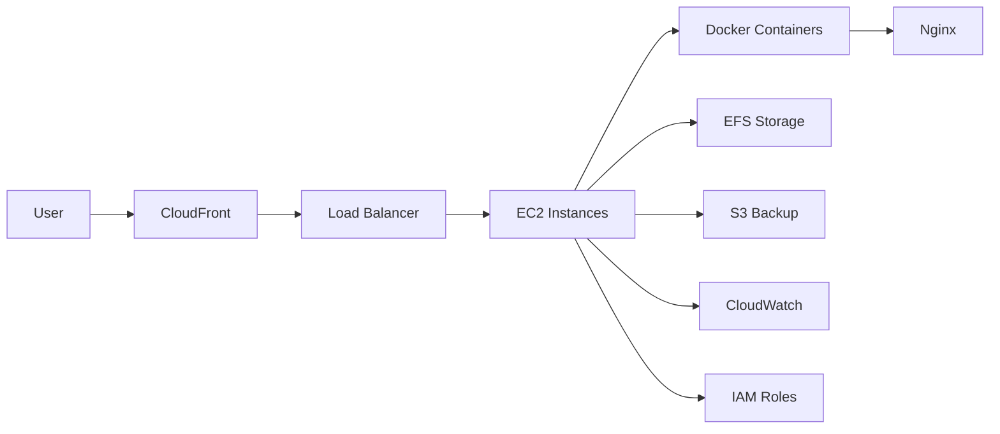
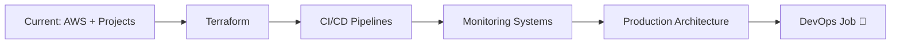

<p align="center">
  
</p>

<h2 align="center">🤖 ULTIMATE AI DEVOPS PORTFOLIO SYSTEM</h2>

<p align="center">
  
</p>

---

## 🧠 AI CORE SYSTEM

```yaml
AI_SYSTEM: HAMZAH_AI_v3
MODE: MULTI-AGENT DEVOPS SYSTEM

AGENTS:
  CloudAgent: AWS Infrastructure
  DevOpsAgent: Automation & CI/CD
  SecurityAgent: IAM & Access Control
  ArchitectureAgent: System Design
  PortfolioAgent: GitHub Optimization

MISSION: Become Production-Ready DevOps Engineer
STATUS: ACTIVE 🚀
```

---

## 🎮 PLAYER ENGINE

```ini
PLAYER = Hamzah Hashmi
CLASS  = DevOps Engineer
LEVEL  = ███████░░░ 70%
MODE   = BUILDING REAL PROJECTS
STATUS = 🔥 IN PROGRESS
```

---

## 🛰️ LIVE CLOUD ARCHITECTURE



---

## 🎬 LIVE PROJECT DEMOS

<table>
<tr>
<td width="50%">

### 🔐 IAM Security Architecture

<a href="https://github.com/hamzahashmi3/01-aws-iam-secure-multi-role-architecture">
  
</a>

**Features**

* MFA enforcement
* Least privilege
* Multi-role system

🔗 [View Repository](https://github.com/hamzahashmi3/01-aws-iam-secure-multi-role-architecture)

</td>
<td width="50%">

### 🐳 EC2 Docker Nginx System

<a href="https://github.com/hamzahashmi3/02-EC2-Docker-Nginx-S3-Backup">
  
</a>

**Features**

* Docker deployment
* Nginx hosting
* Automated S3 backups

🔗 [View Repository](https://github.com/hamzahashmi3/02-EC2-Docker-Nginx-S3-Backup)

</td>
</tr>
</table>

---

## 🧭 FUTURE ROADMAP



---

## ⚙️ DECISION ENGINE

```diff
+ Automate repetitive tasks
+ Secure infrastructure
+ Scale systems
+ Build real projects
```

---

## 🛸 TECH STACK

<p align="center">
  
</p>

---

## 📊 PERFORMANCE

<p align="center">
  
  
</p>

---

## 🐍 LIVE ACTIVITY

<p align="center">
  
</p>

---

## 🌐 CONNECT

<p align="center">
  <a href="https://www.linkedin.com/in/hamza-hashmi-6b5272135/">
    
  </a>
  <a href="mailto:hamzahashmi.office@gmail.com">
    
  </a>
</p>

---

## ⚡ FINAL SYSTEM STATUS

```diff
+ AI Learning: ACTIVE
+ Projects: BUILDING
+ Skills: IMPROVING
! TARGET: DEVOPS ENGINEER 🚀
```

<p align="center">
  
</p>
