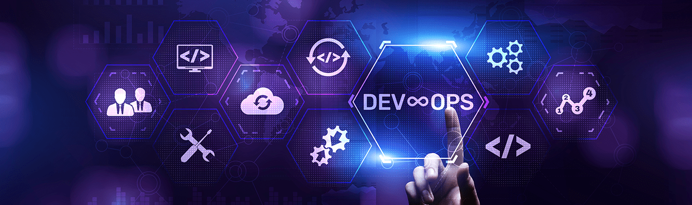

  

<h1 align="center">Hamzah Hashmi</h1>
<h3 align="center">DevOps & Cloud Engineer in Progress • AWS • Docker • Linux • CI/CD</h3>

  

  
  

---

## About Me

I am building my career in **DevOps and Cloud Engineering** with a strong focus on hands-on learning, real-world AWS projects, infrastructure automation, and secure system design.

- Transitioning from **MERN Stack Development** into **DevOps & Cloud**
- Currently learning **AWS Solutions Architect Associate**
- Working with **AWS, Docker, Linux, GitHub Actions, Terraform, Nginx**
- Interested in **IAM, cloud security, automation, CI/CD, and scalable infrastructure**
- Building a portfolio that reflects practical engineering skills

---

## Tech Stack

  

---

## GitHub Analytics

  
  

  

---

## Activity Overview

  

---

## Dev Inspiration

  

---

## Contribution Graph

  

---

## Certifications & Current Direction

- AWS Certified Cloud Practitioner
- Preparing for AWS Solutions Architect Associate
- Building hands-on AWS and DevOps portfolio projects
- Focused on Infrastructure, Security, Automation, and CI/CD

## Featured Projects

### AWS IAM Security Project
A practical IAM security project focused on strong access control and least-privilege design.

- MFA enforcement
- Role-based access structure
- Permission boundaries and secure policy design

### EC2 + Docker + Nginx + S3 Backup
A cloud deployment project showing practical server setup and automated backup workflow.

- Dockerized application deployment
- Nginx-based hosting
- Scheduled S3 backups using cron

### EC2 High Availability Architecture
A high-availability AWS project designed around resilience and scalability.

- Load balancer integration
- Shared storage with EFS
- Multi-instance style architecture thinking

---

## DevOps Mindset

  <b>Automate what is repeatable. Secure what is critical. Scale what matters.</b>

