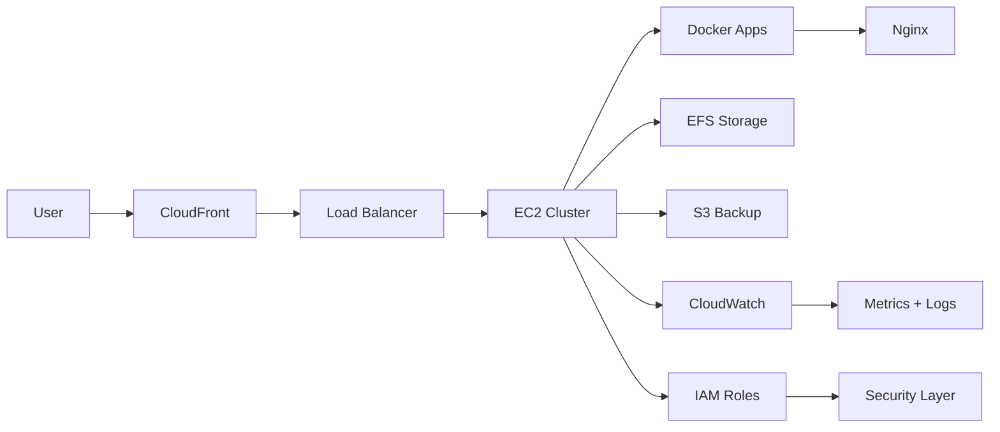

<p align="center">
  
</p>

<h2 align="center">🤖 ULTIMATE AI AGENT PORTFOLIO — DEVOPS CONTROL SYSTEM</h2>

<p align="center">
  
</p>

---

## 🧠 CORE AI SYSTEM

```yaml
AI_SYSTEM: HAMZAH_AI_v1
MODE: MULTI-AGENT
STATE: LEARNING + BUILDING + OPTIMIZING

AGENTS:
  CloudAgent:
    role: AWS Infrastructure Builder
    tools: EC2, S3, IAM, VPC
  DevOpsAgent:
    role: Automation + CI/CD
    tools: GitHub Actions, Docker
  SecurityAgent:
    role: IAM + Access Control
    tools: Policies, MFA
  MonitoringAgent:
    role: Observability
    tools: CloudWatch

GOAL: Become Elite DevOps Engineer
```

---

## 🎮 PLAYER ENGINE

```ini
PLAYER_NAME = Hamzah Hashmi
CLASS       = DevOps Engineer
LEVEL       = 72%
XP_BAR      = ████████░░
RANK        = Apprentice → Engineer → Architect
MODE        = BUILDING REAL SYSTEMS
STATUS      = 🔥 ACTIVE
```

---

## 🛰️ LIVE CLOUD ARCHITECTURE (AI CONTROLLED)



---

## ⚙️ AGENT DECISION ENGINE

```diff
+ Detect repetitive task → Automate
+ Detect risk → Secure
+ Detect load → Scale
+ Detect inefficiency → Optimize
```

---

## 🛸 TECH STACK MATRIX

<p align="center">
  
</p>

---

## 📊 SYSTEM PERFORMANCE

<p align="center">
  
  
</p>

---

## 🐍 LIVE ACTIVITY STREAM

<p align="center">
  
</p>

---

## 🚀 ACTIVE PROJECT SYSTEMS

* 🔐 IAM Security Engine
* 🐳 Docker Deployment System
* ☁️ High Availability Cloud System

---

## 🌐 NETWORK CONNECTION

<p align="center">
  <a href="https://www.linkedin.com/in/hamza-hashmi-6b5272135/">
    
  </a>
  <a href="mailto:hamzahashmi.office@gmail.com">
    
  </a>
</p>

---

## ⚡ FINAL AI SYSTEM STATUS

```diff
+ AI Learning Rate: Increasing
+ Cloud Systems: Expanding
+ Automation Level: Rising
! FINAL STATE: DEVOPS ENGINEER (IN PROGRESS)
```

<p align="center">
  
</p>
