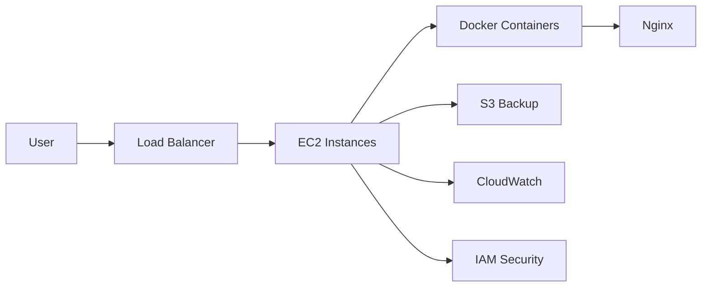
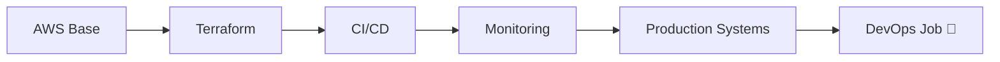

<p align="center">
  
</p>

<h2 align="center">🚀 DevOps & Cloud Engineer | AWS • Docker • Linux • CI/CD</h2>

<p align="center">
  
</p>

## 🧠 Profile Overview


<table>
  <tr>
    <td width="50%" valign="top">
        #### 🧠 Core Skills
        - AWS (EC2, IAM, S3, VPC)
        - Docker & Containers
        - Linux Administration
        - CI/CD (GitHub Actions)
        - IAM & Security
        - Automation & Scripting
    </td>
    <td width="50%" valign="top">
        #### 📈 Roadmap
        - AWS Projects ✅
        - Terraform (Next)
        - CI/CD Pipelines
        - Monitoring
        - Production Systems
        - DevOps Job 🚀
    </td>
  </tr>

  <tr>
    <td width="50%" valign="top">
        #### 🎯 Current Status
        - Transitioning to DevOps
        - Building AWS projects
        - Preparing for AWS SAA
        - Actively seeking roles (UK)
    </td>
    <td width="50%" valign="top">
        #### ⚙️ DevOps Mindset
        - Automate repetitive tasks
        - Secure infrastructure
        - Build scalable systems
        - Monitor & improve

    </td>
  </tr>
</table>


## 🛰️ Example Cloud Architecture (My Approach)



## 🚀 Featured Cloud & DevOps Projects

## 🚀 Featured Projects

<table>
  <tr>
    <td width="50%" valign="top">

### 🔐 AWS IAM Secure Multi-Role Architecture


  <a href="https://github.com/hamzahashmi3/01-aws-iam-secure-multi-role-architecture">
    <p align="center">
      
    </p>
  </a>

**What this project shows**
- MFA enforcement
- Least privilege access control
- Multi-role IAM architecture
- CloudTrail audit visibility

**Why it matters**  
This project demonstrates secure identity and access management in AWS using real-world IAM design principles.

**Links**  
[📂 Repository](https://github.com/hamzahashmi3/01-aws-iam-secure-multi-role-architecture)

</td>
<td width="50%" valign="top">

### 🐳 EC2 Docker Nginx S3 Backup

<a href="https://github.com/hamzahashmi3/02-EC2-Docker-Nginx-S3-Backup">
  
</a>

**What this project shows**
- Dockerized deployment on EC2
- Nginx web hosting
- Automated S3 backup workflow
- Linux and cron-based operations

**Why it matters**  
This project shows deployment, automation, and backup strategy in a practical cloud setup.

**Links**  
[📂 Repository](https://github.com/hamzahashmi3/02-EC2-Docker-Nginx-S3-Backup)

</td>
  </tr>

  <tr>
    <td width="50%" valign="top">

### ☁️ EC2 High Availability Architecture

<a href="https://github.com/hamzahashmi3/03-EC2-High-Availability">
  
</a>

**What this project shows**
- Load balancing
- Shared storage with EFS
- Scalable EC2 architecture
- High availability design thinking

**Why it matters**  
This project highlights production-style AWS architecture focused on resilience, scaling, and uptime.

**Links**  
[📂 Repository](https://github.com/hamzahashmi3/03-EC2-High-Availability)

</td>
<td width="50%" valign="top">

### 🧩 TechnoCannons

<a href="https://github.com/hamzahashmi3/technocannons">
  
</a>

**What this project shows**
- Full-stack development background
- Real-world application building
- Strong software engineering foundation
- Transition path from development to DevOps

**Why it matters**  
This project reflects your software development base, which strengthens your DevOps profile by showing both application and infrastructure understanding.

**Links**  
[📂 Repository](https://github.com/hamzahashmi3/technocannons)

</td>
  </tr>
</table>

## 🧭 FUTURE ROADMAP



---

## 🛸 TECH STACK

<p align="center">
  
</p>

---

## 📊 LIVE PERFORMANCE

<div align="center" style="margin:0; padding:0;">
  
</div>

---

## 🐍 CONTRIBUTION FEED

<p align="center">
  
</p>

---

## 🌐 CONNECT

<p align="center">
  <a href="https://www.linkedin.com/in/hamza-hashmi-6b5272135/">
    
  </a>
  <a href="mailto:hamzahashmi.office@gmail.com">
    
  </a>
</p>

---

## ⚡ FINAL STATUS

```diff
+ Skills: Improving
+ Projects: Growing
+ System: Evolving
! TARGET: DEVOPS ENGINEER 🚀
```

<p align="center">
  
</p>
