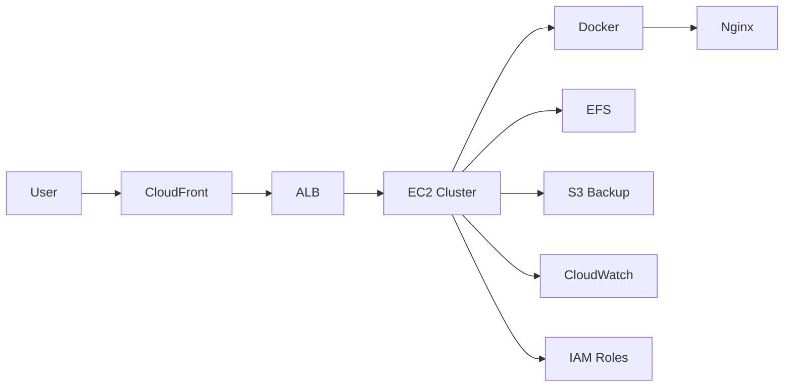
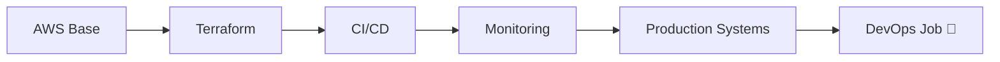

<p align="center">
  
</p>

<h2 align="center">🤖 AI DEVOPS SYSTEM — DARK MODE</h2>

<p align="center">
  
</p>

---

## 🧠 AI CORE SYSTEM

```yaml
AI_SYSTEM: HAMZAH_AI_vFINAL
MODE: MULTI-AGENT

AGENTS:
  CloudAgent: AWS Infrastructure
  DevOpsAgent: CI/CD + Automation
  SecurityAgent: IAM + Protection
  ArchitectureAgent: System Design
  PortfolioAgent: GitHub Optimization

STATE: ACTIVE 🚀
MISSION: Build production-ready systems
```

---

## 🎮 PLAYER ENGINE

```ini
PLAYER = Hamzah Hashmi
CLASS  = DevOps Engineer
LEVEL  = ████████░░ 80%
XP     = Increasing...
MODE   = REAL PROJECTS
STATUS = 🔥 GRINDING
```

---

## 🛰️ LIVE CLOUD ARCHITECTURE



---

## 🎬 LIVE PROJECT SHOWCASE

<table>
<tr>
<td width="50%">

### 🔐 IAM SYSTEM

<a href="https://github.com/hamzahashmi3/01-aws-iam-secure-multi-role-architecture">
  
</a>

✔ MFA
✔ Least Privilege
✔ Role-based access

🔗 Repo:
https://github.com/hamzahashmi3/01-aws-iam-secure-multi-role-architecture

</td>

<td width="50%">

### 🐳 DOCKER SYSTEM

<a href="https://github.com/hamzahashmi3/02-EC2-Docker-Nginx-S3-Backup">
  
</a>

✔ Docker deployment
✔ Nginx hosting
✔ S3 backup

🔗 Repo:
https://github.com/hamzahashmi3/02-EC2-Docker-Nginx-S3-Backup

</td>
</tr>
</table>

---

## 🧭 FUTURE ROADMAP



---

## ⚙️ DECISION ENGINE

```diff
+ Automate everything
+ Secure everything
+ Scale everything
+ Build real projects
```

---

## 🛸 TECH STACK

<p align="center">
  
</p>

---

## 📊 LIVE PERFORMANCE

<p align="center">
  
</p>

---

## 🐍 CONTRIBUTION FEED

<p align="center">
  
</p>

---

## 🌐 CONNECT

<p align="center">
  <a href="https://www.linkedin.com/in/hamza-hashmi-6b5272135/">
    
  </a>
  <a href="mailto:hamzahashmi.office@gmail.com">
    
  </a>
</p>

---

## ⚡ FINAL STATUS

```diff
+ Skills: Improving
+ Projects: Growing
+ System: Evolving
! TARGET: DEVOPS ENGINEER 🚀
```

<p align="center">
  
</p>
